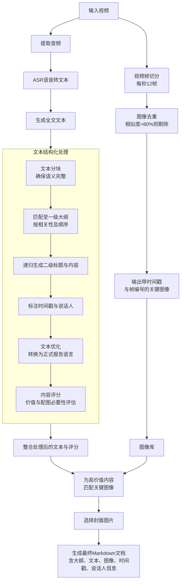

### 优化后的需求描述

当前，我们的 ASR（自动语音识别）模块已基本完成。该模块能够从视频中提取音频并将其转换为文本。接下来，我们需要对音频生成的文本及视频图像部分进行处理。

**核心需求如下：**

1.  **音频文本处理：**
    *   将从视频中提取并转换的完整文本导入系统，并生成文档大纲。
    *   将原始文本按一定长度进行分块（chunk）。分块时需确保语义完整性，例如，若一个段落未结束，则需将后续内容纳入当前块中。
    *   将每个文本块按相似度或相关性匹配到一级大纲下，同时需遵循内容的原始顺序。
    *   匹配后，对归属于每个一级大纲的文本内容，进一步拆分并归纳出二级标题。
    *   通过递归方式，将二级标题下的所属内容也进行归类。
    *   在处理过程中，需清晰标注时间戳和说话人信息。例如，指明一级大纲下的内容对应的时间段和发言者，二级大纲下的具体时间段和观点表达者。

2.  **内容优化与评估：**
    *   将每个二级大纲下的原始文本，转换为与报告主题风格一致的正式文本。
    *   对二级大纲下的原始文本进行评分，评估其是否需要配图以及该段落的内容价值。

3.  **视频图像处理：**
    *   使用 VLM（视觉语言模型）或其他技术处理视频图像：
        *   将视频按每秒12帧切分为图像。
        *   对比图像序列的连续性，若相邻图像相似度超过80%，则去重，仅保留关键帧。
        *   导出的图片需附带时间戳和帧编号。

4.  **整合与输出：**
    *   将处理后的文本（含一级/二级大纲、转换后的文本、得分、时间戳、说话人）与处理后的图像进行整合。
    *   根据二级大纲内容的评分，从处理的图像中选取最合适的图片作为该部分的插图。
    *   从所有图片中，选出最符合报告标题和摘要的图片作为封面。
    *   最终将所有内容整合并导出为 Markdown 格式的文档。

### 系统结构图 (Mermaid)

以下图表直观展示了上述描述的系统工作流程和模块组成：

### 最终输出物说明：
最终系统将产出一个结构清晰的 Markdown 文档，包含：
*   **封面：** 自动选取的最相关图片。
*   **结构化内容：** 一级大纲、二级大纲。
*   **详细信息：** 每部分包含处理后的文本、原始文本（可选）、对应的时间段、说话人信息。
*   **配图：** 在价值较高的部分插入从视频中提取的关键图像。
*   **元数据：** 时间戳、说话人等标识贯穿全文。

希望以上整理和图表能更清晰地表达您的系统设计。