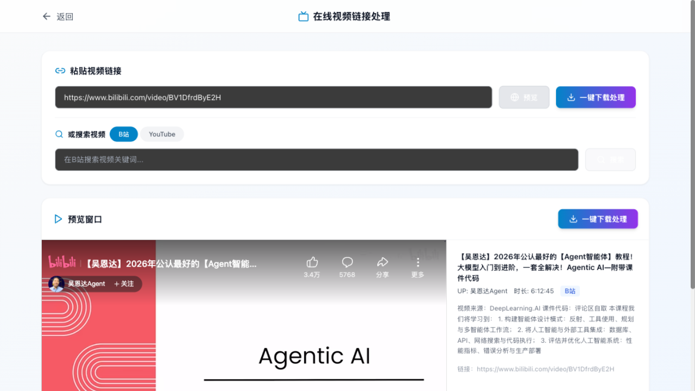
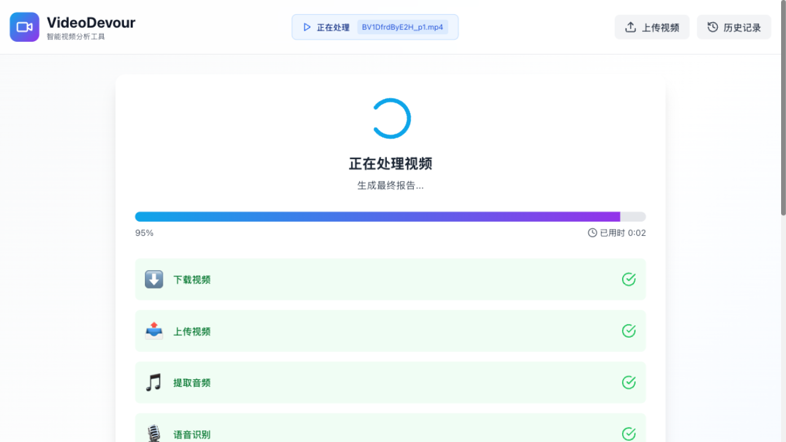
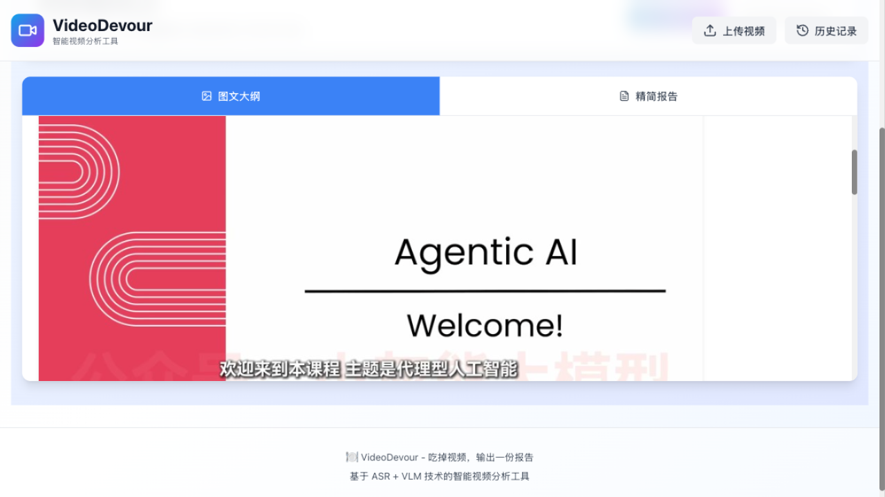
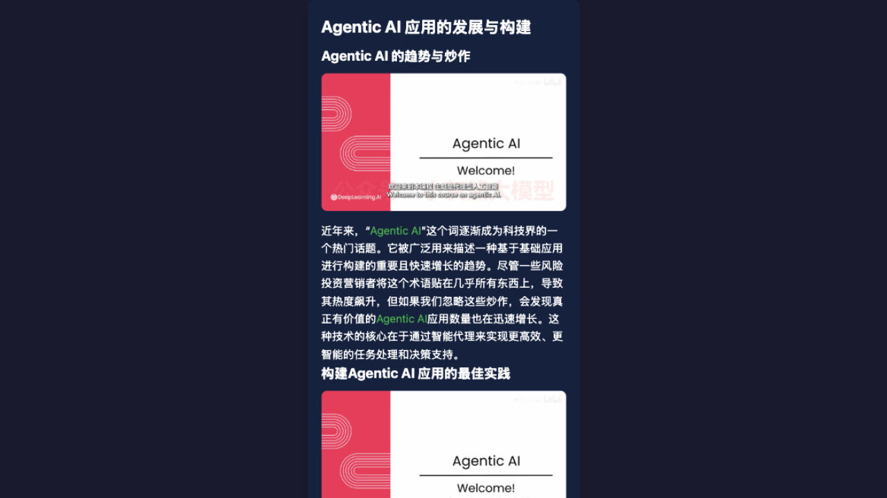
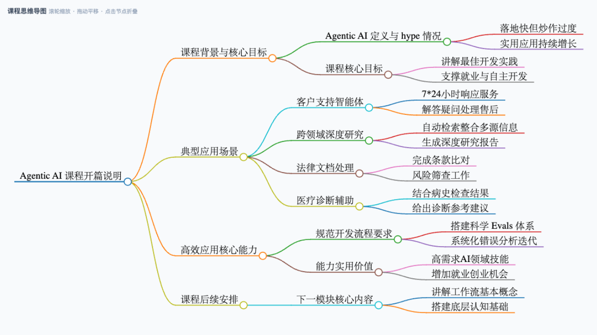
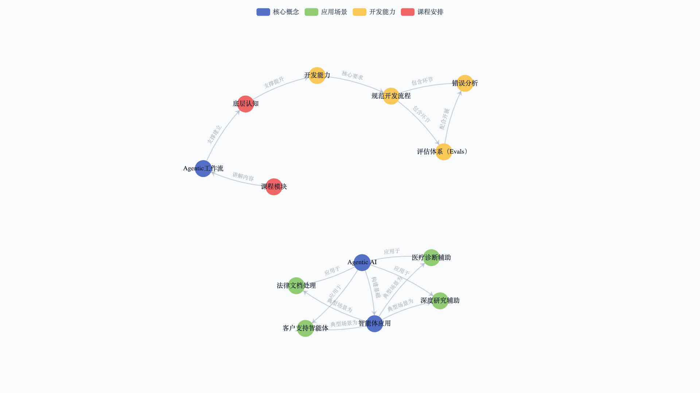

# 🍽️ VideoDevour | 動画を知識レポートに変換するツール

[](https://www.python.org/downloads/)
[](../LICENSE)

**Language / 语言 / 言語**: [简体中文](../README.md) · [English](README_EN.md) · [日本語](README_JA.md)

> 🎯 **コンセプト**：動画を「食べ」て、図表入りのレポートを出力する！
> 🚀 ASR + VLM 技術ベースのインテリジェント動画分析ツール。あらゆる動画を「消化」し、キーフレーム画像・内容サマリー・動画クリップを含む構造化レポートを生成します。

## 📋 目次

- [🎯 概要](#-概要)
- [✨ 主な機能](#-主な機能)
- [🤖 Agent Skill（AI コーディング支援ツールから利用可能）](#-agent-skillai-コーディング支援ツールから利用可能)
- [🖼️ スクリーンショット](#️-スクリーンショット)
- [🔧 技術スタック](#-技術スタック)
- [📦 インストール](#-インストール)
- [🎛️ 設定](#️-設定)
- [🚀 クイックスタート](#-クイックスタート)
- [🏗️ プロジェクト構成](#️-プロジェクト構成)
- [🤝 コントリビューション](#-コントリビューション)
- [📄 ライセンス](#-ライセンス)

> 📖 中国語のみのドキュメント：[新功能说明.md](新功能说明.md)（新機能一覧）、[运行模式与使用示例.md](运行模式与使用示例.md)（スクリーンショット付きの手順解説）。

## 🎯 概要

**VideoDevour（動画を食べる）** は、動画から構造化レポートを抽出・生成することに特化したインテリジェントツールです。生の動画から高品質な図表入りレポートへの変換を全自動で行います。

### 💡 コアバリュー
> **「動画を食べたら、レポートが出てくる。」**
> あらゆる動画の内容を完全に「消化」し、音声情報と視覚情報を抽出。テキストアウトライン・キーフレーム画像・動画クリップを含む高品質レポートを生成します。

### 🎯 活用シーン
- 📚 **学習ノート**：オンライン講座や教学動画を、章立て・画像・文字起こし付きのノートに自動整理。
- 📝 **議事録**：会議の録画を、章別サマリー・発言記録・キーシーン付きの議事録に変換。
- 🎬 **コンテンツ制作**：長尺動画からキーシーンや画像を自動抽出し、二次創作の素材として活用。

## ✨ 主な機能

### 🎙️ 音声認識（ASR）
- **高精度な文字起こし**：**FunASR Paraformer V2** モデルを統合し、句読点を自動付与する高精度な音声認識を実現。
- **話者分離**：動画内の複数の話者を識別・区別できます。
- **正確なタイムスタンプ**：各センテンスにミリ秒精度の開始・終了時刻を付与。
- **デュアルモード**：**オフライン**（ローカル FunASR、API 不要）と**オンライン**（DashScope / StepFun クラウド ASR）を設定画面で切り替え可能。

### 📝 アウトライン生成とコンテンツマッチング
- **スマートなアウトライン生成**：大規模言語モデル（LLM）が文字起こしを分析し、動画の論理構造に沿った階層型 Markdown アウトラインを自動生成。
- **高精度なマッチング**：テキスト類似度アルゴリズムにより、各文字起こしチャンクを対応するアウトライン章に正確に割り当て。

### 🎬 動画・画像処理
- **自動スライス**：生成されたアウトラインの章に応じて、**FFmpeg** が元動画を複数のセグメントに自動分割。
- **フレーム抽出**：各セグメントから固定レート（例：1fps）でフレームを抽出。
- **画像の重複除去**：画像類似度の比較により冗長なフレームを削除し、有効な視覚情報のみを保持。
- **VLM によるキーフレーム選択**：視覚言語モデル（VLM）が候補フレームを評価し、各章に最も適した代表フレームを選出。

### 📜 レポート生成
- **図表入りアウトライン**：テキストアウトラインと VLM が選んだキーフレームを統合し、`detailed_outline.md` を生成。
- **最終仕上げ**：LLM を再度呼び出してアウトラインを推敲・拡張し、より流暢で充実した `final_report.md` を生成。
- **中国語出力保証**：動画の元言語に関わらず、アウトラインとレポートは簡体字中国語で出力（固有名詞は原文表記）。
- **レート制限リトライ**：レート制限・タイムアウト時に指数バックオフで自動リトライし、長時間タスクの安定性を確保。

### 🔗 オンライン動画リンク処理（ビリビリ / YouTube / WeChat チャンネル）
- **リンクを貼るだけで処理**：プラットフォームを自動判別（アプリのシェア文面の貼り付けにも対応）。埋め込みプレーヤーでオンライン再生プレビューができ、ワンクリックでダウンロード・処理へ。
- **キーワード検索**：ビリビリ（公式 API）と YouTube の検索を内蔵。サムネイル・再生時間・投稿者付きカードで表示。
- **WeChat チャンネル（视频号）**：`weixin.qq.com/sph/...` のシェアリンクに対応。設定画面でテンセント元宝（Yuanbao）の Cookie を入力すると、**直接接続パイプライン**（元宝パース → チャンネル feed API → ローカル ISAAC64 復号、サードパーティ不要）でダウンロードできます。自己ホストのリゾルバ（`WECHAT_RESOLVER_URL`）や、デスクトップキャプチャツール（[ltaoo/wx_channels_download](https://github.com/ltaoo/wx_channels_download)）の利用も可能。
- `yt-dlp` 駆動。ビリビリのレート制限バックオフリトライと、YouTube の Cookie 対応（`YTDLP_COOKIES_FILE`）を内蔵。

### 🎓 ラーニング支援
- **オプション生成**：マインドマップ / ナレッジグラフ / ラーニングカードは**デフォルトで自動生成されません**。アップロードやリンク処理時に「完了時に生成」へチェックを入れると、レポート完成時に自動生成。レポート画面のボタンからいつでも手動生成も可能です。
- **9 段階の学習ステージ**：自由学習（デフォルト）/ 小学 / 中学 / 高校 / 大学 / 修士 / 博士 / 深掘り研究 / 専門分野研究 —— 内容の深さが段階に応じて変化します。
- **ラーニングカード**：レポートをワンクリックでスマートフォンサイズの Bento Grid 風 HTML カードに変換。
- **マインドマップ**：講座内容を 3 階層のインタラクティブなマップ（拡大・折りたたみ可）に整理し、全体像を素早く把握。
- **ナレッジグラフ**：講座の概念と関係を力学的ネットワーク図として可視化（カテゴリ別の配色・関係ラベル・ホバー説明付き）。
- **Markdown エクスポート**：アウトライン＋レポートを 1 つの `.md` ファイルに統合（画像は base64 埋め込み、オフラインで閲覧可能）。

### 🤖 Agent Skill（AI コーディング支援ツールから利用可能）

コア機能は [Agent Skills](https://agentskills.io) オープン規約（`.agents/skills`）に準拠したスキルとしてパッケージされています。Codex / Claude Code / Cursor など、規約に対応したあらゆる agent から Web UI を起動せずに直接呼び出せます：

```bash
# 動画を検索
python3 .agents/skills/videodevour/scripts/devour.py search "キーワード" --platform bilibili
# リンク情報を取得（タイトル/投稿者/再生時間/サムネイル）
python3 .agents/skills/videodevour/scripts/devour.py info "https://www.bilibili.com/video/BV..."
# WeChat チャンネル：元宝 Cookie の確認 / シェアリンクのダウンロード
python3 .agents/skills/videodevour/scripts/devour.py wechat --check
python3 .agents/skills/videodevour/scripts/devour.py wechat "https://weixin.qq.com/sph/..."
# ワンクリック処理：ダウンロード → ASR → アウトライン → キーフレーム → 図表入りレポート
python3 .agents/skills/videodevour/scripts/devour.py process "https://www.bilibili.com/video/BV..." --level 高中
# 最新レポートを読む
python3 .agents/skills/videodevour/scripts/devour.py report --latest
```

- 学習ステージ：自由学習（デフォルト）/ 小学 / 中学 / 高校 / 大学 / 修士 / 博士 / 深掘り研究 / 専門分野研究
- スクリプトは自動的にプロジェクトの `.venv` で再実行されます。プロジェクトルートは `--home` → `VIDEO_DEVOUR_HOME` → スクリプト位置の順に解決。
- ローカルインストール：`ln -s <repo>/.agents/skills/videodevour ~/.agents/skills/videodevour`
- `process` は同期ブロッキングコマンドのため、agent から呼び出す際はタイムアウトを 10 分以上に設定してください。

## 🖼️ スクリーンショット

スクリーンショットはすべて、ビリビリ動画 [ウー・エンダー Agentic AI 講座 p1](https://www.bilibili.com/video/BV1DfrdByE2H) の実際の処理結果です
（完全な手順は [docs/运行模式与使用示例.md](运行模式与使用示例.md) を参照。ページは中国語です）。

**ビリビリ / YouTube のリンクを貼って、埋め込みプレーヤーでプレビュー、ワンクリック処理：**



**処理パイプラインのリアルタイム可視化（ダウンロード → 文字起こし → アウトライン → キーフレーム → レポート）：**



**図表入りアウトライン：VLM が各章に最適なキーフレームを選出：**



**AI ラーニングカード：レポートをスマホサイズの Bento Grid 復習カードに変換：**



**マインドマップ：講座内容を拡大・折りたたみ可能な 3 階層ツリーに整理：**



**ナレッジグラフ：概念と関係を力学的ネットワークで可視化：**



## 🔧 技術スタック

| コンポーネント | 技術 | 説明 |
|---------------|------|------|
| **コアパイプライン** | Python | メイン開発言語。 |
| **音声認識** | FunASR (Paraformer V2) | Alibaba 製のオープンソース高精度 ASR モデル。 |
| **LLM/VLM 連携** | Camel-AI | LLM・VLM との軽量な対話フレームワーク。 |
| **動画/画像処理** | FFmpeg, OpenCV | 動画スライス・フレーム抽出・画像処理。 |
| **テキストマッチング** | Sentence Transformers | テキストの意味類似度計算。 |

## 📦 インストール

### 要件
- Python 3.12+（環境・依存関係の管理には [uv](https://docs.astral.sh/uv/) を推奨）
- FFmpeg（`brew install ffmpeg` / `apt install ffmpeg`）
- GPU は任意：NVIDIA CUDA または Apple Silicon MPS を自動検出、GPU なしでは CPU にフォールバック。

### 手順

```bash
# 1. リポジトリをクローン
git clone https://github.com/datawhalechina/video-devour.git
cd video-devour

# 2. 依存関係をインストール（uv 推奨：.venv を自動作成し uv.lock に基づきインストール）
uv sync

# uv を使わない場合：
pip install -r requirements.txt
```

## 🎛️ 設定

すべての設定は**設定コンソール**（下記参照）から行うのがおすすめです。ファイルを手動で編集する必要はありません。手動設定を希望する場合は `backend/algorithm/config.template.py` を `config.py` としてコピーして編集してください。API キーは環境変数 `LLM_API_KEY` / `VLM_API_KEY` で注入することも可能です。

## 🚀 クイックスタート

### 設定コンソール（推奨）

起動後、任意のページ右下の ⚙ ボタン（または `/settings`）からすべての設定を完了できます：

- **ASR モード**：`オフライン`（ローカル FunASR Paraformer、API 不要）または `オンライン`（DashScope / StepFun クラウド、モデルのダウンロード不要）
- **LLM / VLM**：API キー・ベース URL（OpenAI 互換サービス全般）・モデル名を入力。主要プロバイダのワンクリック設定と接続テスト付き
- **デフォルト学習ステージ**：9 段階から選択（自由学習 / 小学 / … / 専門分野研究）
- **WeChat チャンネル**：元宝 Cookie を入力するとチャンネルのシェアリンク ダウンロードが有効化（手順は下記）

設定はプロジェクトルートの `settings.json` に保存されます（gitignore 済み、秘密情報を含むためコミット禁止）。タスク実行ごとにランタイム設定へ注入されます。`backend/algorithm/config.py` が存在しなくてもバックエンドは起動できます。

### オンライン動画リンク処理（ビリビリ / YouTube / WeChat チャンネル）

「リンク処理」ページでは、ファイルをアップロードせずに URL から直接レポートを生成できます：

- **リンク貼り付け**：プラットフォーム自動判別＋埋め込みプレーヤーでのプレビュー。アプリのシェア文面にも対応
- **キーワード検索**：ビリビリ（公式 API）と YouTube。サムネイル・再生時間・投稿者付きカードをクリックでプレビュー
- **ワンクリック処理**：yt-dlp でダウンロード（mp4 自動結合）→ 標準パイプライン（ASR → アウトライン → キーフレーム → レポート）

注意点：
- ビリビリは未ログインでは約 720p まで。高頻度リクエストはリスク制限を誘発する場合があります（Cookie フィンガープリントと自動リトライを内蔵）
- YouTube はボット判定あり：メタデータは oEmbed に自動フォールバック。ダウンロードにはブラウザからエクスポートした Cookie（Netscape 形式）を `YTDLP_COOKIES_FILE` で指定
- **WeChat チャンネル**：`weixin.qq.com/sph/...` のシェアリンクを貼るだけ（検索・埋め込みプレビュー非対応）。チャンネルには公開直リンクがないため、以下の 3 経路を優先度順に使用します：
  1. **直接解決（推奨）**：設定画面でテンセント元宝の Cookie を入力（「[WeChat チャンネル Cookie の設定](#wechat-チャンネル-cookie-の設定)」を参照）。バックエンドが元宝パース API で exportId+token を取得 → チャンネル feed API でメディア URL を取得 → `decodeKey` がある場合は先頭 128KB を ISAAC64 でローカル復号（WechatSphDecrypt アルゴリズム、独立実装とクロス検証済み）→ ffprobe で検証。サードパーティサービス不要
  2. **自己ホストのリゾルバ**：`WECHAT_RESOLVER_URL` を設定（Bearer トークン任意）。[ltaoo/wx_channels_download](https://github.com/ltaoo/wx_channels_download) の sph worker と互換
  3. **ローカルキャプチャ**：解析がすべて失敗した場合のフォールバック。wx_channels_download デスクトップツール（WeChat デスクトップクライアント＋ルート証明書＋ローカルプロキシが必要、ワークフローは [joeseesun/qiaomu-wx-video](https://github.com/joeseesun/qiaomu-wx-video) を参照）でダウンロードしたファイルをアップロード
- 処理するコンテンツの権利を保有しているか、許可を得ている場合のみにしてください。個人学習目的に限ります。

### WeChat チャンネル Cookie の設定

チャンネルの解析には、テンセント元宝（[yuanbao.tencent.com](https://yuanbao.tencent.com)）のログイン状態が必要です。初回のみ設定すればよく、Cookie は通常数週間有効です：

1. ブラウザで [yuanbao.tencent.com](https://yuanbao.tencent.com) を開いてログイン（WeChat スキャンで OK）
2. `F12` でデベロッパーツールを開き → **Network** タブに切り替え → ページを更新
3. `yuanbao.tencent.com` 宛の任意のリクエストをクリック → Request Headers の `Cookie:` の値を**完全に**コピー
4. VideoDevour の設定コンソール（任意ページ右下の ⚙ ボタン）→「WeChat チャンネル」→ **元宝 Cookie** に貼り付け → 保存

Web UI を使わない場合（どちらか一方で OK）：

- プロジェクトルートの `settings.json` に記入：`"wechat_yuanbao_cookie": "<Cookie>"`
- 環境変数を設定：`export YUANBAO_COOKIE="<Cookie>"`

> Cookie はローカルにのみ保存され（`settings.json` は gitignore 済み、UI ではマスク表示）、外部に送信されることはありません。
> Agent Skill ユーザーは `devour.py wechat --check` で Cookie の有効性をワンクリック確認できます。401 エラー時は上記手順で再取得してください。

### ラーニング支援（オプション生成）

- **マインドマップ / ナレッジグラフ / ラーニングカード**：デフォルトでは自動生成されません —— アップロードまたはリンク処理時に「完了時に生成」へチェック、またはレポート画面からいつでも手動生成
- **Markdown エクスポート**：アウトライン＋最終レポートを 1 つの Markdown ファイルとしてダウンロード（画像は base64 埋め込み、オフライン閲覧可）
- **学習ステージ**：9 段階（自由学習が汎用デフォルト）。LLM の出力深度が段階に応じて変化
- LLM 呼び出しはレート制限時に自動リトライ（指数バックオフ＋ジッター）

### サービスの起動

#### 1. バックエンド
プロジェクトルートで実行：
```bash
# 依存関係のインストールと仮想環境の有効化
uv sync
source .venv/bin/activate

# バックエンドを起動
uvicorn backend.api.main:app --reload --host 0.0.0.0 --port 8000
```

バックエンドは `http://localhost:8000` で起動します。

#### 2. フロントエンド
新しいターミナルで：
```bash
cd frontend
npm run dev
```

フロントエンドは `http://localhost:3000` で起動します。

### Web UI の使い方

1. **動画をアップロード**：メインページでファイルを選択またはドラッグ＆ドロップ
2. **処理モニター**：アップロード後、自動的に処理ページへ移動し、進捗と経過時間をリアルタイム表示
3. **レポート閲覧**：処理完了後、自動的にレポートページへ移動
4. **履歴**：履歴ページで過去のタスクを管理

### コマンドライン（任意）

CLI から直接動画を処理することもできます：

```bash
python backend/algorithm/main.py "path/to/your/video.mp4"
```

実行が完了すると、ログ・ASR 結果・動画クリップ・キーフレーム・最終レポートなどすべての出力が、`output/` 配下の動画名＋タイムスタンプ付きフォルダに保存されます。

## 🏗️ プロジェクト構成

```
video-devour/
├── 📁 backend/
│   ├── 📁 algorithm/            # コア処理アルゴリズムとパイプライン
│   │   ├── pipeline.py          # エンドツーエンドの処理パイプライン
│   │   ├── main.py              # CLI エントリーポイント
│   │   ├── settings_store.py    # ランタイム設定（settings.json の読み書きと注入）
│   │   ├── report_viz.py        # マインドマップ/ナレッジグラフ/ラーニングカード生成
│   │   ├── config.template.py   # 手動設定テンプレート（config.py は gitignore 済み）
│   │   ├── data_processor.py    # ASR 後処理
│   │   ├── llm_handler.py       # LLM ハンドラ（リトライ/中国語出力保証）
│   │   ├── vlm_handler.py       # VLM ハンドラ
│   │   ├── image_processor.py   # フレーム処理とキーフレーム選択
│   │   ├── video_handler.py     # 動画スライスとフレーム抽出
│   │   ├── outline_handler.py   # アウトライン処理とレポート生成
│   │   └── text_similarity_matcher.py  # 見出しとチャンクの意味マッチング
│   ├── 📁 api/
│   │   └── main.py              # FastAPI アプリ（全 API エンドポイント）
│   └── 📁 devour/               # 動画取得と ASR エンジン
│       ├── video_downloader.py  # リンクダウンロード（ビリビリ/YouTube/WeChat チャンネル）
│       ├── asr_factory.py       # ASR エンジンファクトリ（オフライン/オンライン切替）
│       ├── asr_engine_paraformer_v2.py  # ローカル FunASR エンジン
│       ├── asr_engine_dashscope.py      # DashScope オンラインエンジン
│       ├── asr_engine_stepfun.py        # StepFun オンラインエンジン
│       └── ...                  # その他のエンジン
├── 📁 frontend/                 # React フロントエンド
│   ├── 📁 src/
│   │   ├── 📁 components/       # React コンポーネント（アップロード/リンク/レポート/設定）
│   │   └── 📁 api/              # API クライアント
│   ├── package.json             # フロントエンド依存関係
│   └── vite.config.js           # Vite ビルド設定
├── 📁 .agents/skills/videodevour/  # Agent Skill（cross-agent エントリーポイント）
├── 📁 docs/                     # 機能説明と使用例ドキュメント
├── 📁 output/                   # 処理結果の出力先（実行時に生成）
├── 📁 models/                   # （任意）ローカル ASR モデルファイル
├── 📄 pyproject.toml            # uv プロジェクト設定（Python ≥3.12）
├── 📄 requirements.txt          # pip 依存関係（pyproject と同等）
└── 📄 README.md                 # プロジェクトドキュメント（中国語）
```

## 🤝 コントリビューション

あらゆる形のコントリビューションを歓迎します！

1. 🍴 このプロジェクトを Fork
2. 🌟 フィーチャーブランチを作成 (`git checkout -b feature/AmazingFeature`)
3. 💻 変更をコミット (`git commit -m 'Add some AmazingFeature'`)
4. 📤 ブランチにプッシュ (`git push origin feature/AmazingFeature`)
5. 🔄 Pull Request を作成

## 📄 ライセンス

本プロジェクトは MIT ライセンスの下で公開されています。詳細は [LICENSE](../LICENSE) をご参照ください。
