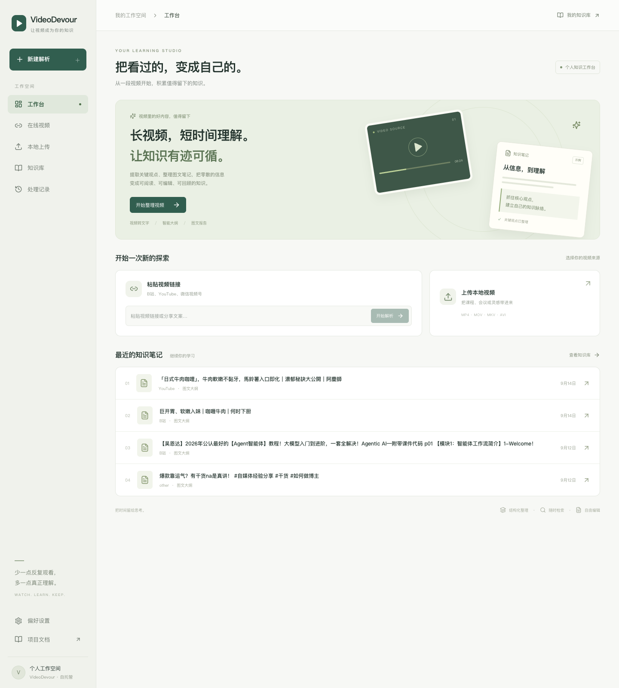
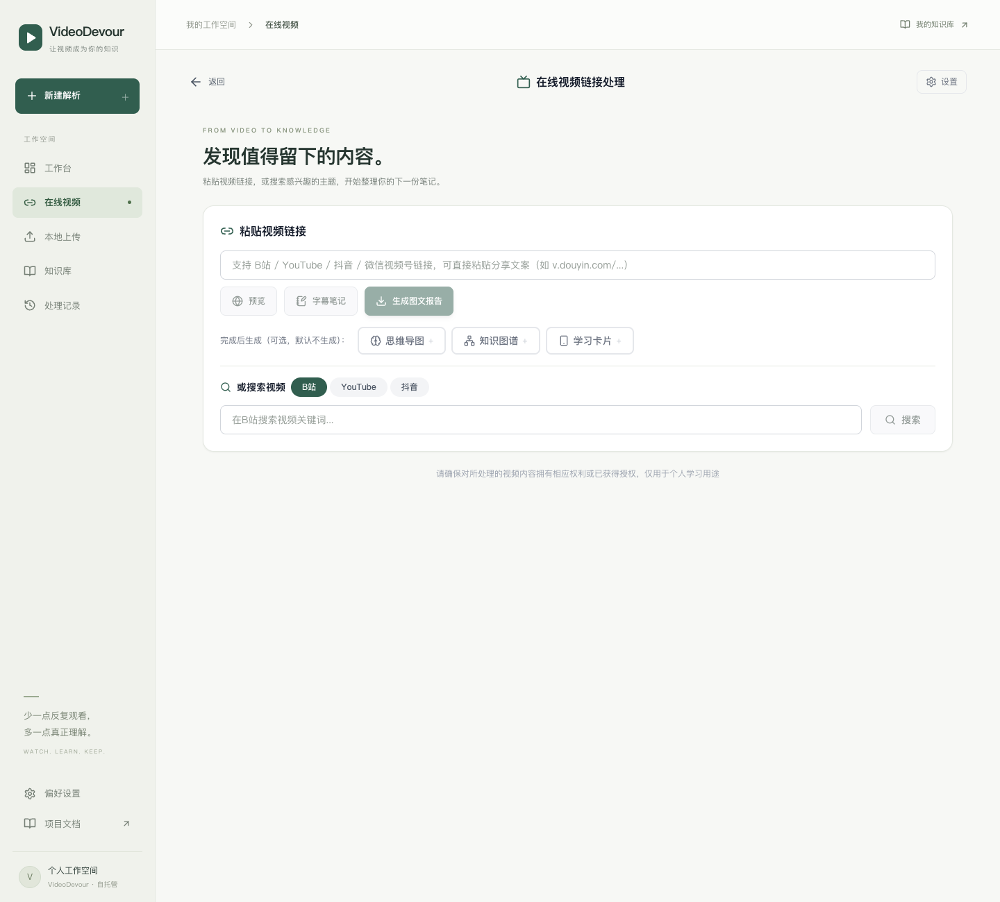
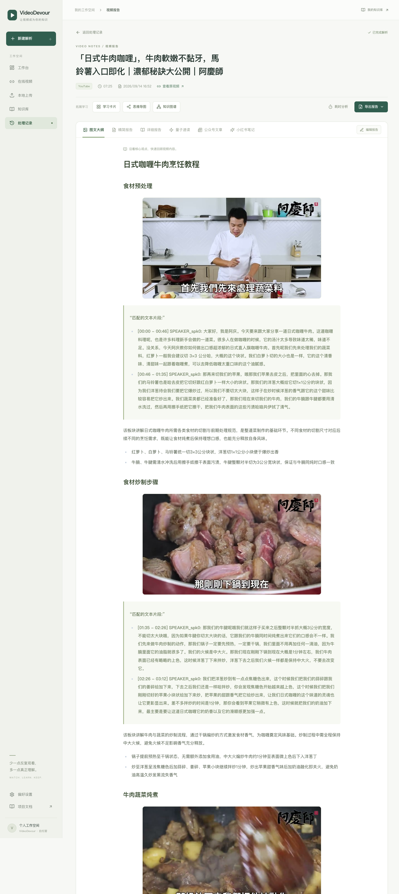
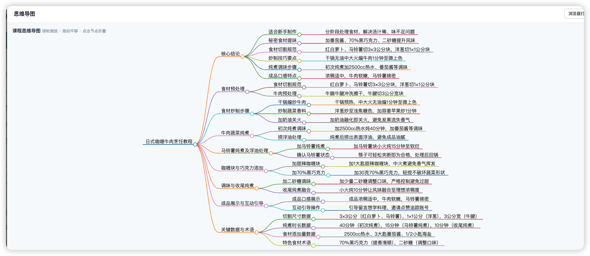
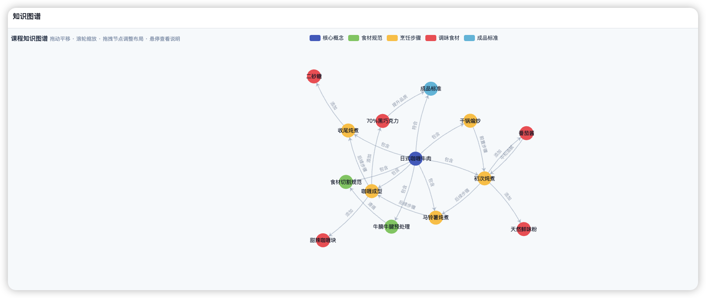
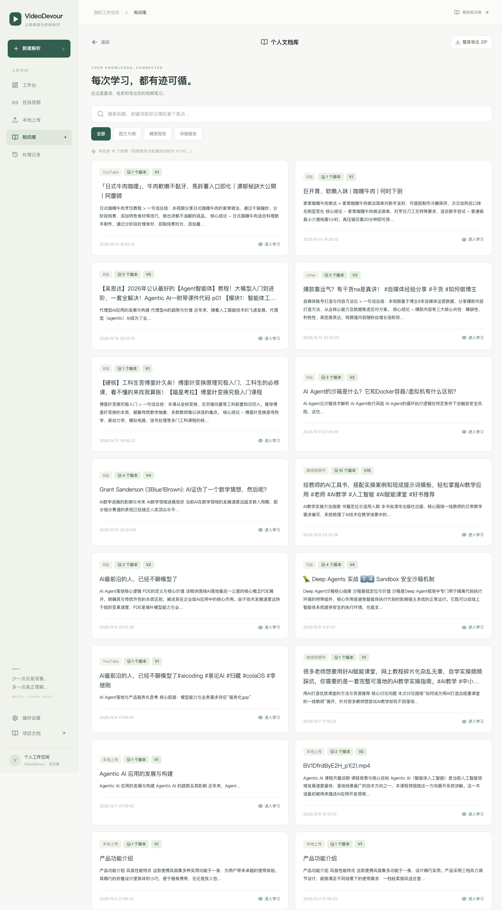
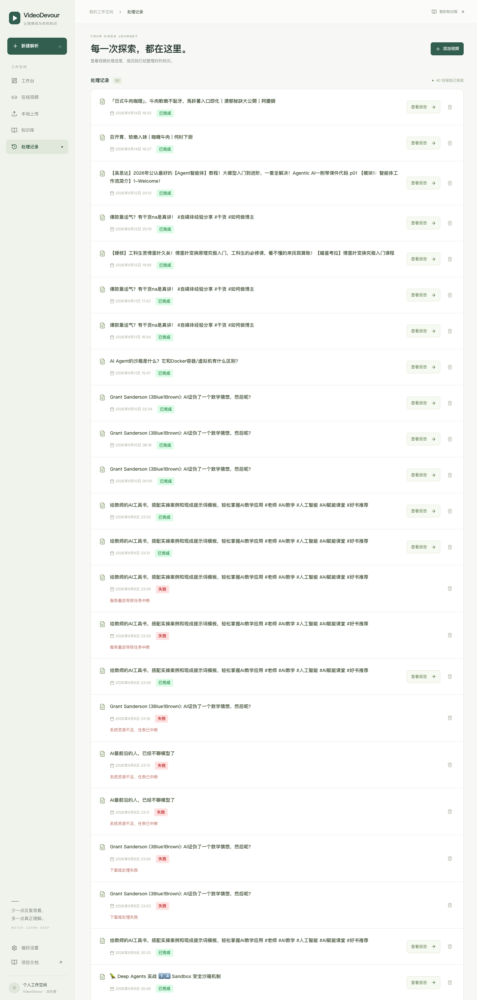

# 不必下载、转码、找字幕：VideoDevour 客户端如何把多平台视频变成你的知识库

> VideoDevour 的核心体验已经收敛为两件事：用桌面客户端把复杂环境藏起来；把 B站、YouTube、抖音、微信视频号和本地文件接进同一条“先预览、再下载、后沉淀”的知识处理链路。

我们每天都在看视频：课程、访谈、演讲、会议录屏、行业分享、做菜教程。

可真正需要回顾时，常常只剩下一个模糊印象——“我好像看过”“里面有个观点不错”“那张图在第几分钟来着”。重新拖动进度条、找字幕、翻收藏夹、手动截图，最后又把时间消耗在重复观看上。

VideoDevour 最初的出发点很简单：**如果视频是信息的入口，那么工具应该帮助我们走到理解、沉淀和复用，而不是停在一句摘要。**

因此，最新版不再把自己设计成一个孤立的“视频总结页”。它一方面把常用能力封装进桌面客户端，另一方面把来自多个内容平台的视频接入一个统一的工作台：左侧是工作台、在线视频、本地上传、知识库和处理记录；中间是一条从“导入视频”到“沉淀笔记”的连续路径。



*新版工作台：暖白与深绿的界面把“开始整理”和“最近的知识笔记”放在同一处，强调持续积累而非一次性生成。*

## 首选入口：把能力装进桌面客户端

对大多数用户来说，最合适的打开方式不是配置 Python、FFmpeg、模型依赖和命令行，而是直接使用 VideoDevour 桌面客户端。客户端采用 **pywebview 桌面壳 + 本地 FastAPI 服务**：启动后就是熟悉的知识工作台，视频、任务、报告和设置保存在电脑本地数据目录中。

桌面客户端的价值不只是“有个图标可以双击”，而是把容易阻碍第一次使用的环节变成了明确的界面步骤：

- **无需手工启动前后端**：普通用户通过安装包或绿色版即可进入工作台；Windows 10/11 使用 WebView2 Runtime。
- **轻量优先**：当前轻量客户端以在线视频/在线 ASR 图文报告为主要路径，不把体积很大的本地 ASR 模型塞进首次安装包。
- **设置集中在应用内**：ASR、LLM、VLM、学习阶段、下载环境和各平台登录态都在「偏好设置」中管理。
- **应用内登录读取 Cookie**：在 Windows 上可打开内嵌登录窗口，登录 B站、YouTube、腾讯元宝或抖音后读取应用自身会话，避免直接读取 Chrome/Edge Cookie 时常见的加密与文件锁问题。
- **资料留在本机**：设置、任务记录、上传文件、输出报告和日志保存在客户端的数据目录；但报告生成所使用的在线 ASR / LLM / VLM 仍会按你的配置请求相应云端接口。

这意味着，客户端让“把一条视频变成笔记”变成一条面向普通用户的操作链，而不是一套开发环境搭建题。

## 先说结论：它能做什么？

VideoDevour 将本地视频或在线视频链接转化为结构化知识内容，并保留后续阅读与复用的入口。

- **导入视频**：支持本地上传，也支持 B站、YouTube、抖音、微信视频号的链接或分享文案。
- **两种整理速度**：已有字幕的视频可直接生成“字幕笔记”；需要完整沉淀时，可生成带章节、关键帧和报告的图文内容。
- **理解视频，而不只是转文字**：语音识别生成文本，模型提取章节结构，视觉模型从视频画面中挑选具有代表性的关键帧。
- **一份内容，多种阅读方式**：图文大纲、精简报告、详细报告之外，还可以按需生成量子速读、公众号文章、小红书笔记、学习卡片、思维导图和知识图谱。
- **把历史内容留下来**：所有结果进入本地知识库；同一视频多次处理会保留 V1/V2 等版本，可按标题、关键词或记得的观点搜索，也可以整库导出。

它适合课程学习、会议复盘、研究资料整理、内容创作素材归档，也适合任何“这段视频值得以后再看，但我不想再从头看”的时刻。

## 核心能力一：多信源下载与预览，先确认再处理

旧式视频处理工具通常从“上传一个文件”开始。VideoDevour 则把公开视频平台、本地文件和知识沉淀接进同一条路径：

**视频来源 → 平台识别与信息预览 → 确认下载/上传 → 整理任务 → 多形态笔记 → 知识库版本 → 检索与再创作**

“先预览”是这条路径中很重要的一步。用户粘贴链接或整段 App 分享文案后，系统会提取真实 URL、识别来源平台，并优先读取标题、作者、时长、封面等元数据。B站和 YouTube 可在页面内播放确认；抖音和视频号受平台公开嵌入能力限制，界面会展示可获得的信息并给出对应的下载处理路径，而不会假装所有来源都能在网页中直接播放。

| 来源 | 可以怎么进入 | 预览与下载边界 |
| --- | --- | --- |
| B站 | 粘贴链接/分享文案，或关键词搜索 | 可读元数据、使用官方播放器预览，再下载处理；部分能力可能受登录态与平台限制影响 |
| YouTube | 粘贴链接或关键词搜索 | 可使用嵌入播放器确认内容；遇到 bot 校验时仍会尽量提供基本信息，下载通常需配置 Cookie 与 JS 运行时 |
| 抖音 | 粘贴视频页、短链或分享文案，支持登录后搜索 | 系统会归一化链接；抖音没有可靠的公开网页内嵌预览，下载与搜索需要有效登录态 |
| 微信视频号 | 粘贴分享链接或分享文案 | 不支持站内搜索和网页内嵌预览；可通过元宝 Cookie 走解析下载，失败时可先本地捕获再上传 |
| 本地视频 | 拖拽或选择 MP4、MOV、MKV、AVI 等文件 | 无需下载，直接进入相同的整理流水线 |

同一条链接再次处理时，项目会查询本地下载缓存，命中后直接复用视频而不是重复下载。对经常复盘课程、反复调整学习阶段或补生成不同报告版本的用户，这能明显减少等待和存储浪费。

在“在线视频”页面，用户还可以选择两种处理强度：

- 想快速了解内容，可以点击 **字幕笔记**；它直接利用平台已有字幕生成纯文本 Markdown 笔记，不下载视频、不做 ASR，适合 B站与 YouTube 的轻量阅读。
- 想保留章节、关键画面和完整报告，则点击 **生成图文报告**，进入完整处理链路。

用户还可以在提交前勾选“完成后生成”的附加内容：思维导图、知识图谱和学习卡片。它们默认不生成，避免所有任务都承担额外等待；真正需要复习或展示时再开启。



*操作展示 1：当前在线视频页面。粘贴链接或分享文案后，先预览确认，再选择字幕笔记或生成图文报告；下方可按需勾选思维导图、知识图谱、学习卡片。*

## 核心能力二：报告不是终点，而是一份可以继续工作的材料

完整任务会经历媒体获取/上传、音频提取、语音识别、章节生成、文本匹配、关键帧筛选与报告生成等环节。项目使用 FastAPI 管理任务与 API，使用 FFmpeg、OpenCV 处理媒体，使用本地或在线 ASR 获取文本，再结合 LLM/VLM 完成章节组织、报告撰写与关键画面筛选。

最终呈现的不是一整块难以阅读的转写，而是一份有层级、有画面、有依据的材料。报告页把阅读和下一步动作放在一起：

- **图文大纲**：先用章节和关键帧建立整体框架；
- **精简报告 / 详细报告**：按不同阅读深度回顾内容；
- **量子速读 / 公众号文章 / 小红书笔记**：在需要时基于报告生成相应表达；
- **学习卡片、思维导图、知识图谱**：把同一份内容转成更适合复习或建立关联的形式；
- **导出报告**：可导出 Markdown、PDF 或带原图的 ZIP。



*操作展示 2：新版报告阅读器。顶部可切换图文大纲、精简报告、详细报告及衍生文体，正文保留章节、关键帧、匹配文本和提炼要点。*

## 一份报告，三种风格化文章：从理解到表达不用重写

一份视频资料常常服务于完全不同的场景：你可能想先在 30 秒内抓重点，随后整理成公众号长文，最后再写成适合社交平台传播的短笔记。若每次都从转写稿重新提炼，不仅耗时，也容易在不同版本里漏掉关键信息。

VideoDevour 把“风格化文章”做成报告页中的按需能力。它以信息密度最高的精简报告为共同素材，并只允许使用报告里已有的事实、数据、名称、结论和关键帧；不是凭空编一个看似流畅、却与原视频脱节的内容。生成结果会落盘缓存，之后再次查看、下载或进入知识库时可以直接复用。

| 风格化产物 | 适合什么时候用 | 内容形态 |
| --- | --- | --- |
| **量子速读** | 先判断这支视频值不值得深读 | 30 秒读完的一句话大意、三个核心洞察，以及一句可直接发朋友圈的表达 |
| **公众号文章** | 把课程、访谈或行业分享整理为可发布长文 | 有标题、开场钩子、3–5 个小节、收束段落的图文成稿，并尽量保留对应关键帧 |
| **小红书笔记** | 用轻量内容分享方法、观点或学习收获 | 第一人称短句、emoji 分点、图文穿插和贴合内容的话题标签 |

这不是简单换一套语气。量子速读解决“有没有时间看”的问题；公众号文章解决“怎样讲清楚”的问题；小红书笔记解决“怎样让别人愿意停下来读”的问题。它们共用同一份经过结构化整理的事实底座，因此可以更快产出，也更容易保持内容一致。

## 思维导图与知识图谱：一个看层级，一个看关系

长视频的难点不只在信息多，还在信息之间的关系难以一次看清。VideoDevour 因此没有把可视化当成报告末尾的装饰，而是把它设计成两种不同的理解工具。

- **思维导图**适合先建立“树”。它将报告整理为三层左右的主题分支，支持缩放、折叠与展开。第一次学习一门课程时，先看导图能迅速知道“这门课从哪里开始、分成哪些模块、每一章解决什么问题”。
- **知识图谱**适合继续找“网”。它从报告中抽取概念、实体与关系，使用可拖拽的力导向网络呈现；节点按类别区分，边标注关系，悬停可查看说明。它尤其适合发现跨章节的联系，例如一个工具如何对应某种方法、一个概念又支撑哪些场景。
- **学习卡片**适合最后做“记忆点”。它将内容排成面向手机阅读的 Bento Grid 风格卡片，适合在零碎时间复习。

一个实用的阅读顺序是：**先看图文大纲定位事实 → 用思维导图建立章节框架 → 用知识图谱寻找概念连接 → 用学习卡片做轻量复习 → 需要对外表达时再生成风格化文章。**

这些内容都支持在报告页按需生成，并以 HTML 成果缓存到任务目录。下次打开时不必重新等待；在客户端中，它们会通过应用内预览呈现，而不是弹出一堆难以管理的新窗口。



*操作展示 3：实际报告页中的思维导图。它把章节结构、操作顺序与时间/用量信息放到同一张图中，并支持缩放、拖动和节点折叠。*



*操作展示 4：实际报告页中的知识图谱。它用“包含、遵循、添加、后续步骤、符合”等关系，把章节目录中不易看出的关联显式化；可拖拽节点、缩放并悬停查看说明。*

## 案例：不同类型的视频，最后会变成什么？

同一套处理链路并不会把所有视频压成同一种“摘要”。视频的内容结构不同，最有价值的交付物也不同。下面是使用项目中已完成任务整理出的三个案例：

| 视频类型与样本 | 系统抓住了什么 | 最适合留下的成果 |
| --- | --- | --- |
| **实操教程**：日式咖喱牛肉烹饪 | 食材尺寸、操作顺序、火候、时长和关键画面 | 图文大纲 + 带关键帧的步骤报告 + 思维导图 |
| **技术课程**：Agentic AI 入门课 | 概念定义、应用场景、技能要素和章节之间的依赖 | 精简报告 + 详细报告 + 知识图谱 |
| **观点/经验分享**：自媒体爆款内容复盘 | 方法论、数据例证、问答观点和可复用表达 | 量子速读 + 公众号文章 + 小红书笔记 |

### 案例一：把“看一遍就忘”的烹饪视频，变成可以照着做的步骤卡

在一支日式咖喱牛肉教程中，系统没有只写出“教你做咖喱”这样的笼统结论，而是将视频拆成食材预处理、炒制、炖煮、加入咖喱块与巧克力、收尾调味等章节。报告保留了与步骤对应的关键帧，并抽出了可直接执行的数据：例如食材切块尺寸、先炖煮 40 分钟、马铃薯再炖 15 分钟，以及最后 10 分钟的风味融合。

这种内容最适合用**图文大纲和思维导图**。前者让人照着画面完成某一步，后者让人快速理解整道菜的先后关系。它的价值不在于替你“学会做菜”，而是把视频中容易遗漏的顺序、火候和用量，变成可回看、可核对的操作材料。

### 案例二：把技术课从“听懂几个概念”，变成一张可复习的知识网络

对于 Agentic AI 入门课程，视频的重点不在某一个画面动作，而在概念和概念之间的关系。报告会按章节组织代理 AI 的趋势与价值、可落地的应用场景，以及构建代理系统所需的关键能力；关键帧用于保留课程讲解或示意信息，正文则承担定义、机制和场景解释。

这类内容推荐先读**精简报告**，判断课程结构；再用**详细报告**回到原文与例子；最后打开**知识图谱**，把“应用场景—关键技能—构建方法”等彼此分散的知识点连成网络。对技术学习来说，图谱的意义是发现关联，而不是用一张漂亮图代替理解；需要写方案或复盘项目时，仍应回到报告和原视频核对关键结论。

### 案例三：把观点型分享，变成能继续传播的内容资产

在一支关于自媒体爆款内容的经验分享中，报告提取的重点是可复用的方法论与数据例证：稀缺性、利他性、高密度表达三类共性，以及不同内容类型的涨粉数据、表达技巧和创作者面对数据焦虑时的复盘思路。它既包含观点，也包含数字和案例，因此特别适合保留“证据从哪里来”的阅读路径。

这时，视频报告不只服务于学习，还可以服务于表达：先用**量子速读**快速抓住三条结论；需要完整阐释时生成**公众号文章**；要做轻量分享时切换到**小红书笔记**。三种输出都以原报告为事实底座，减少“重新写一遍时改得面目全非”的风险；其中的数字、引用和判断，发布前仍应回看原视频确认。

### 怎样判断一条视频最适合哪一种结果？

- **步骤多、画面关键的教程**：优先完整图文报告、关键帧、思维导图；不要只看一段文字总结。
- **概念多、前后依赖强的课程**：优先精简/详细报告和知识图谱；把图谱当成复习地图，而不是结论本身。
- **观点密集、准备对外转述的分享**：先用量子速读判断价值，再按公众号或小红书风格生成初稿。
- **会议录屏、访谈、演讲**：优先从章节与原文匹配开始，重点核对人物、数字、承诺和时间点；画面价值较弱时，文字结构比关键帧更重要。

## 核心能力三：让每一次处理都成为下一次学习的起点

真正的变化发生在任务结束之后。新版加入了“知识库”这一层：每个视频是一张知识卡片，同一来源重复处理会自动形成版本链。卡片同时显示来源、版本、摘要和进入学习的入口。

当资料积累起来后，你无需记住文件夹或任务编号，只需要输入自己记得的标题、关键词或一个观点。知识库会在图文大纲、精简报告、详细报告等内容中检索，并支持整库打包导出。



*操作展示 5：知识库以视频为单位聚合内容，并保留版本信息。搜索时可切换全部、图文大纲、精简报告和详细报告。*

## 客户端如何完成一次多信源视频整理？

### 第一步：普通用户直接打开桌面客户端

Windows 用户可使用安装包或绿色版启动客户端；绿色版需完整解压后运行，不能只单独复制 `.exe`。首次运行后，先进入左下角的「偏好设置」完成 ASR、LLM、VLM 的连通性配置。

如果要处理 B站 AI 字幕、YouTube 受限下载、抖音搜索/下载或微信视频号链接，请在设置页配置相应登录态。Windows 推荐点击“应用内登录读取”：在弹出的 WebView2 窗口中完成正常登录即可，Cookie 会保存在客户端本机，不需要在浏览器开发者工具中反复复制。

### 开发者也可以源码启动

推荐使用 Python 3.12+ 和 `uv` 管理依赖；处理视频需要本机安装 FFmpeg。

```bash
git clone https://github.com/datawhalechina/video-devour.git
cd video-devour
uv sync
./start.sh
```

浏览器打开 `http://localhost:8000` 后，即可看到同一套新版工作台。源码模式适合本地开发、调试和扩展；普通用户仍建议优先使用客户端。

### 第二步：粘贴来源，预览后再开始下载

点击「在线视频」，把 B站、YouTube、抖音或微信视频号链接直接粘贴进去；从 App 复制的一整段分享文案也可以。先点“预览”，确认标题、封面、作者与时长是否正确，再选择字幕笔记或生成图文报告。这样可以避免把同名内容、错误分集或不需要的视频下载进本地。

本地资料则进入「本地上传」拖入视频文件。两种入口在提交后都会进入同一套报告和知识库流程。

### 第三步：在“处理记录”中掌握任务状态

处理不是黑盒。每一项任务都会保留名称、时间、完成/失败状态及“查看报告”入口；正在执行的任务会显示阶段和进度，并定时刷新。这样即使关闭了当前页面，之后也可以从处理记录回到任务。



*操作展示 6：处理记录将视频任务按时间沉淀，完成后可直接进入报告；失败任务保留原因，便于判断是否需要重新处理。*

### 第四步：选择适合自己的阅读方式

第一次打开报告，建议从“图文大纲”开始：先看章节和关键帧，建立内容地图；再切到“精简报告”快速阅读；需要核对细节时，再查看“详细报告”。

准备复习时，先打开思维导图建立章节框架，再用知识图谱找概念间的关联，最后生成学习卡片；准备对外表达时，则按场景打开量子速读、公众号文章或小红书笔记。新版将这些生成动作改为按需触发：不用的内容不等待，需要时也能复用已生成结果。

### 第五步：让内容进入知识库，而不是落在下载文件夹里

处理完成的内容会自动进入「知识库」。后续可以按关键词找回视频笔记，进入某条内容继续阅读，或将整库导出为 ZIP。对于使用 Codex、Claude Code、Cursor 等 AI 工具的开发者，项目还提供了本地 MCP 文档库服务，便于其他 AI 客户端搜索、读取或导出已经积累的内容。

## 这套能力是怎样实现的？

从工程上看，VideoDevour 将“视频理解”拆成多个可独立演进的环节：

| 层级 | 技术与职责 |
| --- | --- |
| 客户端层 | pywebview 桌面壳承载本地工作台与应用内登录读取，降低普通用户的启动和 Cookie 配置门槛 |
| 交互层 | React、Vite、Tailwind CSS 与 Framer Motion 构建响应式知识工作台 |
| 服务层 | FastAPI 提供视频、任务、报告、设置、知识库与导出接口 |
| 媒体层 | yt-dlp 处理受支持的平台链接；FFmpeg 与 OpenCV 完成媒体处理、切分和抽帧 |
| 理解层 | 本地 FunASR 或在线 ASR 生成文本；LLM 生成大纲与报告；VLM 参与关键帧筛选 |
| 知识层 | 本地文档库按视频和版本沉淀结果，使用 BM25 支持中英文混合检索，并可通过 MCP 对外提供能力 |

这种分层带来的好处是：前端呈现的是清晰的学习路径，后端保留的是可观察的任务过程，最终得到的则是可复用的知识资产。

## 也要说清楚它的边界

VideoDevour 用 AI 减少重复整理，但不能替代人的判断。

1. **请尊重内容权利与平台规则**：只处理自己拥有权利、已获得授权，或合理个人学习范围内使用的内容。
2. **重要结论仍需人工核对**：数字、引用、专有名词、敏感事实和对外发布文案，都应回到原始视频或权威来源复核。
3. **“本地”不等于完全离线**：本地 ASR 可以在本机完成转写；如使用云端 LLM/VLM 生成报告或视觉分析，仍需要网络和相应 API 配置。
4. **平台可用性会变化**：受登录态、内容权限、平台策略与网络环境影响，某些链接可能无法获取或需要重新配置 Cookie。

## 结语

新版 VideoDevour 想传递的并不是“用 AI 更快地刷视频”，而是另一种节奏：

**少一点反复观看，多一点真正理解。**

打开客户端，粘贴一条来自任意支持平台的视频链接，先预览、再下载、后沉淀；最后留下章节、画面、笔记和可继续使用的内容。把时间留给判断、联想和创造——这就是 VideoDevour 从视频出发、但不止于视频的原因。

---

项目地址：[datawhalechina/video-devour](https://github.com/datawhalechina/video-devour)
