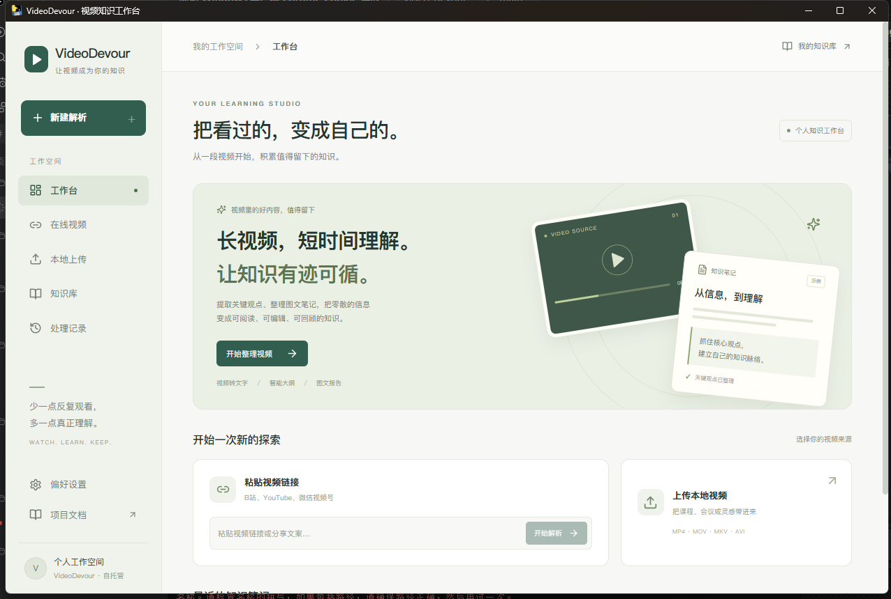
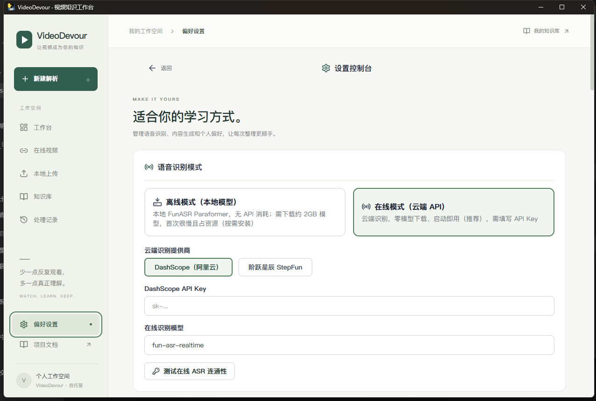
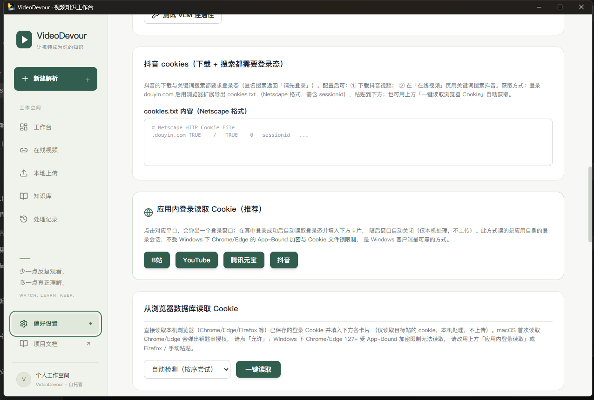
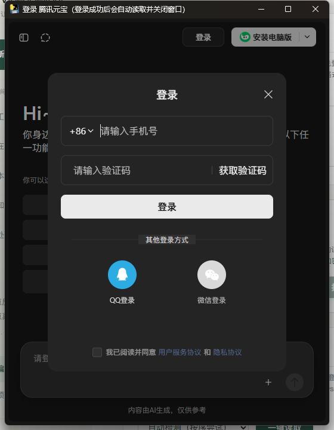
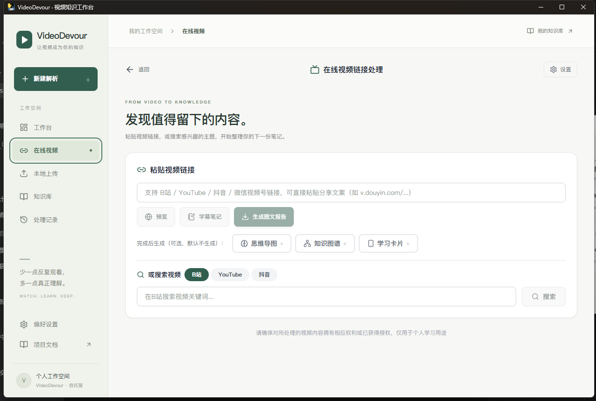
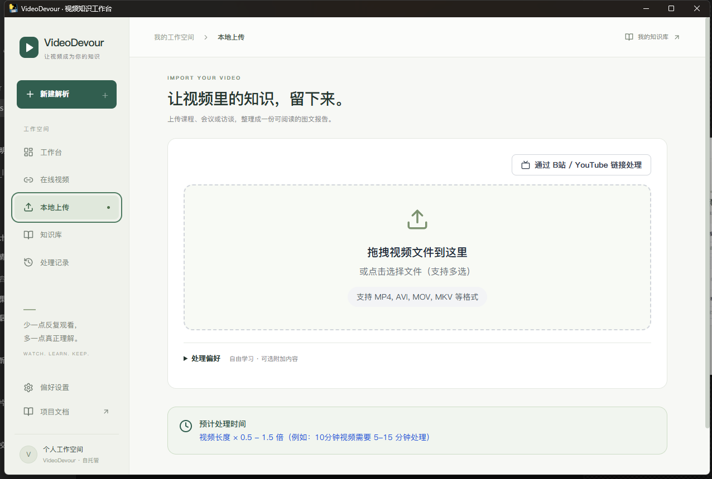
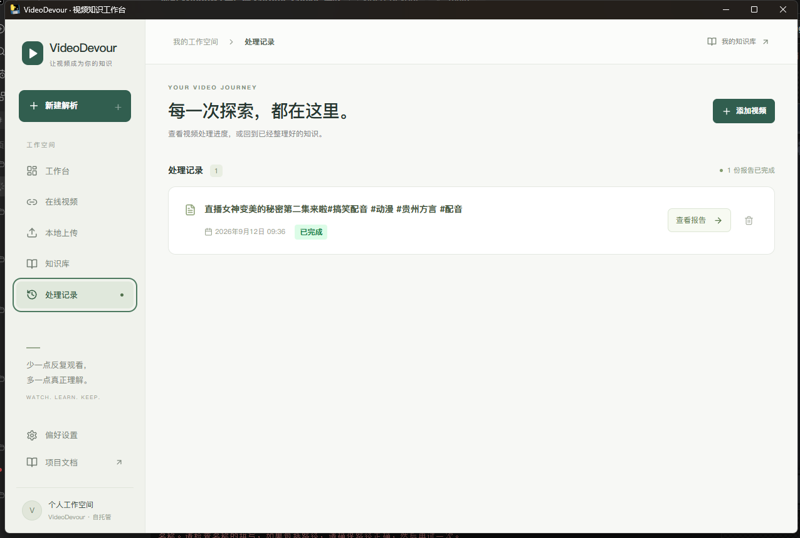
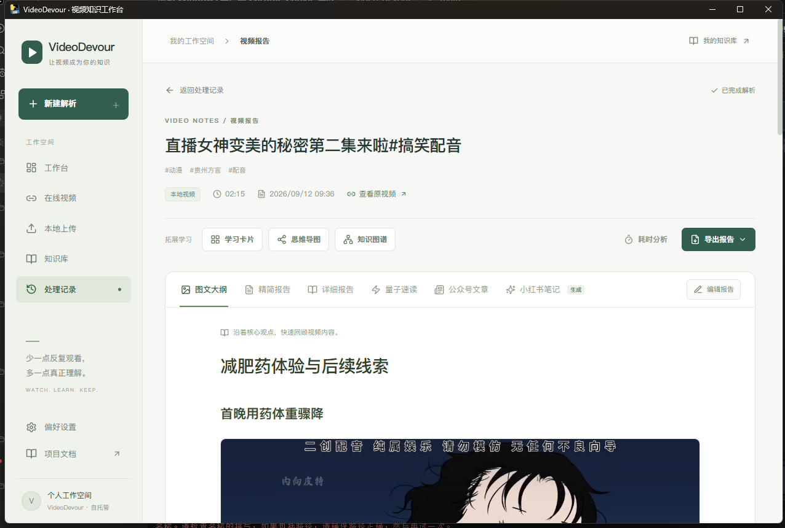

# VideoDevour Windows 客户端使用指南

面向普通用户的分步图文教程。跟着做一遍，你就能把一条视频链接或本地视频，变成一份带关键帧的图文报告。

全程在本机完成，视频与 Cookie 都不会上传到第三方服务器（报告仍需调用你自己配置的云端 ASR / LLM / VLM 接口）。

---

## 系统要求

| 项目 | 要求 |
|------|------|
| 操作系统 | Windows 10 / 11（64 位） |
| 运行时 | WebView2 Runtime（Windows 11 与较新版 Windows 10 已内置；缺失时安装程序会提示） |
| 磁盘 | 约 500 MB（程序本体）+ 视频与报告占用的空间 |
| 网络 | 需要；语音识别与图文生成调用云端接口 |

---

## 第一步：安装并启动

### 方式一：安装包（推荐）

1. 双击 `VideoDevour-<版本>-setup.exe`。
2. 按向导下一步安装（默认装到 `%LOCALAPPDATA%\Programs\VideoDevour`，**不需要管理员权限**）。
3. 从开始菜单或桌面的快捷方式启动。

### 方式二：绿色版

下载 `VideoDevour-windows-x64.zip` 后**完整解压**，再双击里面的 `VideoDevour.exe`。

> ⚠️ 绿色版是 onedir 结构，不能只把 `.exe` 单独拎出来运行，必须连同同目录的 `_internal` 文件夹一起。

### 首次运行会看到 SmartScreen 提示

因为当前安装包和可执行文件**尚未做代码签名**，Windows 会弹「Windows 已保护你的电脑」。
点「更多信息」→「仍要运行」即可。这是预期行为，不是病毒。

启动后你会看到工作台首页：

---

## 第二步：认识主界面

左侧是主导航，从上到下依次是：

| 入口 | 用途 |
|------|------|
| **新建解析 / 在线视频** | 粘贴 B站、YouTube、抖音等链接，直接在线处理 |
| **本地上传** | 处理电脑里的视频文件 |
| **知识库** | 浏览已经整理好的所有笔记 |
| **处理记录** | 查看历史任务与处理进度 |
| **偏好设置** | 配置 API Key、Cookie、默认学习阶段 |

第一次使用，先花两分钟去「偏好设置」把 AI 能力配好，否则点「生成报告」会因为没有 API Key 而失败。

---

## 第三步：配置 AI 能力（偏好设置）

点击左下角「偏好设置」，你会看到语音识别模式的配置：

需要配置三块能力，都支持 OpenAI 兼容接口：

### 1. 语音识别（ASR）

- 选**在线模式（云端 API）**，零模型下载、启动即用，这是客户端的默认推荐。
- 选一家提供商（DashScope 阿里云 / 阶跃星辰 StepFun），填入对应 API Key。
- 点「测试在线 ASR 连通性」确认可用。

> 离线模式需要下载约 2GB 本地模型，轻量客户端包**不含**该依赖，客户端里请使用在线模式。

### 2. LLM 配置（生成报告正文）

在同一个页面往下滚动，找到「LLM 配置」：

- 从快捷供应商里选一家（DashScope / StepFun / DeepSeek / 火山方舟 / OpenAI / 自定义），接口地址会自动填好。
- 填 API Key，选模型名，点「测试 LLM 连通性」。

### 3. VLM 配置（挑选关键帧）

继续往下是「VLM 配置」。VLM 负责从视频画面里挑出值得放进报告的关键帧，**不配会导致报告没有图片**。

- 同样选供应商、填 Key、选模型，点「测试 VLM 连通性」。

三块都配置完，点页面右上角的「保存设置」。

---

## 第四步：配置登录 Cookie（解锁完整能力）

有些功能需要登录态：B站 AI 字幕、YouTube 防机器人校验、抖音下载与搜索、微信视频号解析。客户端提供两种获取方式，**Windows 上推荐用「应用内登录读取」**。

滚动到设置页的 Cookie 区域：

### 方式一：应用内登录读取（推荐）

点对应平台的按钮（B站 / YouTube / 腾讯元宝 / 抖音），会弹出一个登录窗口。

在窗口里正常登录（手机验证码、扫码、账号密码都行），登录成功后**窗口会自动关闭**，登录态被自动读取并填入下方卡片。

这个方式的原理是读取应用自身的 WebView2 会话，因此**不受 Windows 下 Chrome/Edge 的加密与文件锁限制**，是最可靠的一种。

### 方式二：从浏览器数据库读取

点「一键读取」。它会尝试直接读取本机浏览器（Chrome / Edge / Firefox 等）已保存的 Cookie。

> macOS 上首次读取 Chrome/Edge 会弹钥匙串授权，点「允许」。
> **Windows 上 Chrome/Edge 127+ 的 Cookie 受 App-Bound 加密保护，且运行时被浏览器独占锁定，第三方在非管理员权限下读不到**。遇到这种情况，请改用上面的「应用内登录读取」，或用 Firefox，或手动粘贴。

### 方式三：手动粘贴

每个平台下方都有对应的输入框，按提示从浏览器开发者工具里复制 Cookie 粘贴进去即可。

> 所有 Cookie 只保存在本机 `%LOCALAPPDATA%\VideoDevour\settings.json`，不会上传。

---

## 第五步：处理在线视频

点左侧「在线视频」：

1. 把视频链接或 App 分享文案粘贴到输入框（支持 B站 / YouTube / 抖音 / 微信视频号，分享文案可以直接整段粘贴）。
2. 按需点「预览」先确认标题、时长、封面是不是你要的那条。
3. 「完成后生成」可以勾选额外的思维导图、知识图谱、学习卡片，不勾选也能正常出报告。
4. 点「生成图文报告」，客户端会自动下载视频并开始处理。

你也可以用页面下方的「搜索视频」，直接在 B站 / YouTube / 抖音里搜关键词找内容。

---

## 第六步：处理本地视频

点左侧「本地上传」：

- 把视频文件**拖拽**到虚线框里，或点击选择文件（支持多选、批量处理）。
- 支持 MP4、AVI、MOV、MKV 等常见格式。
- 展开「处理偏好」可以选择学习阶段与附加内容。

> 处理时间大致是视频时长的 0.5 到 1.5 倍，例如 10 分钟的视频大约需要 5 到 15 分钟。

---

## 第七步：查看与管理报告

处理完成后，在左侧「处理记录」里能查到所有任务：

点某条任务的「查看报告」进入报告页：

报告页顶部可以切换多种形态：

- **图文大纲 / 精简报告 / 详细报告**：不同颗粒度的正文
- **量子速读 / 公众号文章 / 小红书笔记**：面向不同场景的改写版本
- **拓展学习**：学习卡片、思维导图、知识图谱
- 右上角「导出报告」可以导出为文件

---

## 常见问题

**Q：点「生成报告」没反应或报错？**
先检查偏好设置里的 ASR / LLM / VLM 三块是否都填了 Key 并通过了连通性测试。报告需要三者配合：ASR 转录文字、LLM 组织内容、VLM 挑选关键帧。

**Q：报告里没有图片？**
通常是 VLM 没有配置或配置错误。VLM 负责挑选关键帧，缺失时报告会只有文字。

**Q：B站视频的「字幕笔记」用不了？**
B站 AI 字幕只对登录态可见，需要在设置页配置 B站账号（SESSDATA），推荐用「应用内登录读取」获取。

**Q：YouTube 下载提示需要登录验证？**
配置 YouTube Cookie（第四步），或使用内置的「下载环境自检」排查。

**Q：应用内登录窗口登录后没有自动关闭？**
确保登录**完全成功**（例如元宝要对勾同意协议后再登录）。如果只是关掉了窗口，会提示「登录窗口已关闭，未读取到登录态」，重新点一次即可。

**Q：我的数据和设置存在哪？**
`%LOCALAPPDATA%\VideoDevour`，包含设置、任务记录、上传的视频、生成的报告和日志。卸载程序不会删除这个目录，重装后配置仍在。

**Q：为什么首次运行有安全提示？**
当前分发包未做代码签名，属于预期现象，详见第一步。

---

## 相关文档

- 桌面客户端的构建与架构说明：[desktop/README.md](../desktop/README.md)
- 完整功能说明：[新功能说明.md](新功能说明.md)
- 运行全流程示例：[运行模式与使用示例.md](运行模式与使用示例.md)
