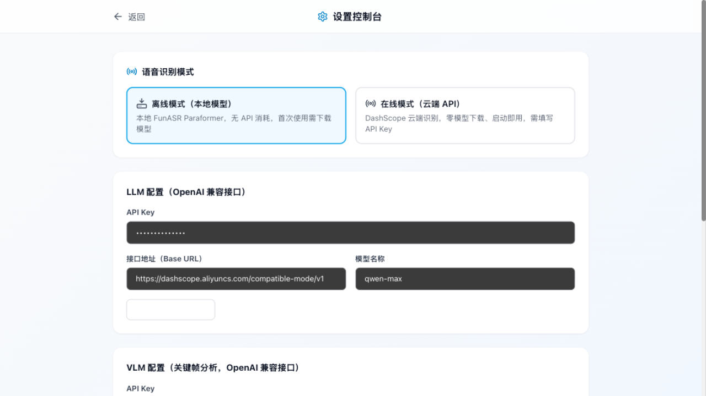
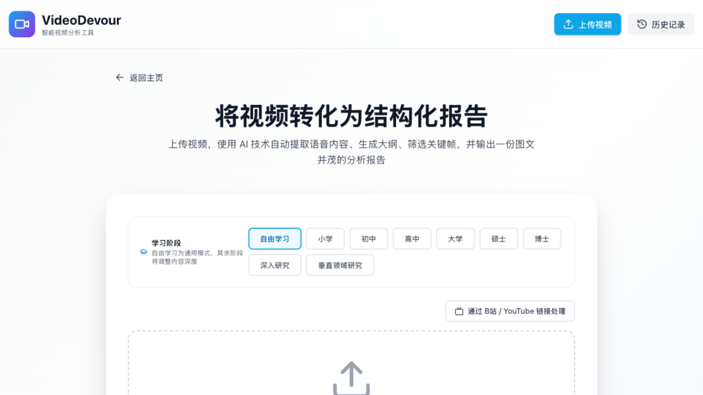
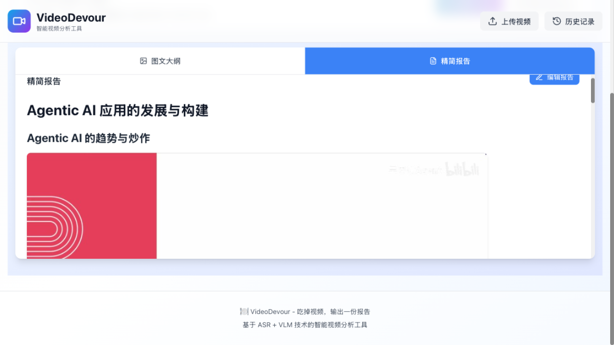
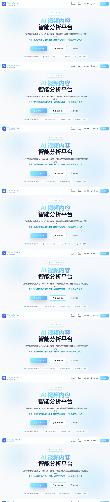

# VideoDevour 运行模式与使用示例

> 本文以 B站视频 [【吴恩达】Agentic AI 课程 p1](https://www.bilibili.com/video/BV1DfrdByE2H) 为例，
> 用真实截图完整展示系统从配置到产出的运行全流程。

---

## 运行模式总览

```
                          ┌──────────────────────────┐
  视频来源                 │      VideoDevour 后端      │            产出
  ─────────────           │                          │         ─────────────
  本地视频上传 ──────────► │  ASR 转写（离线/在线）      │ ──────► 图文大纲（含关键帧）
  B站 / YouTube 链接 ────► │  LLM 大纲与报告（中文）     │ ──────► 精简报告
  （yt-dlp 下载/搜索）      │  VLM 关键帧评分            │ ──────► 学习卡片（HTML）
                          │  ffmpeg 切分 / 抽帧        │ ──────► 导出 Markdown（图内嵌）
                          └──────────────────────────┘
```

- **两种输入**：本地视频文件上传，或直接粘贴 B站 / YouTube 链接（自动下载）
- **两种 ASR 模式**：离线（本地 FunASR Paraformer，GPU 加速，数据不出本机）/ 在线（DashScope 云端，免模型下载）
- **一条流水线**：转写 → 大纲 → 内容匹配 → 视频切分 → 抽帧 → VLM 选关键帧 → 图文报告

---

## 步骤 0：配置控制台

首次使用先打开 **控制台**（首页右上角 →「控制台」，或访问 `/settings`）：



- **语音识别模式**二选一：离线模式（本地模型，无 API 消耗）或 在线模式（云端 API，零模型下载）
- **LLM / VLM**：填写 API Key 与任意 OpenAI 兼容接口地址，可一键连通性测试
- 本例配置：离线 ASR + `qwen-max`（LLM）+ `qwen-vl-max`（VLM）

## 步骤 1：提交视频（两种方式）

**方式 A · 上传本地视频**——在上传页选择学习阶段后拖入视频文件：



**方式 B · 粘贴 B站 / YouTube 链接**——在「链接处理」页粘贴链接点击「预览」，
内嵌播放器可直接确认内容，再点「一键下载处理」：


> 本例使用方式 B：粘贴吴恩达课程链接 `BV1DfrdByE2H`。多P合集只处理当前分P（p1，约 2 分钟）。

## 步骤 2：处理进度

提交后自动进入进度页，八个阶段实时打勾（下载视频 → 上传 → 提取音频 → 语音识别 →
大纲生成 → 内容匹配 → 关键帧 → 报告）：


本例在 Apple 芯片上以离线模式 + GPU 跑完 2 分钟视频的转写约需十几秒，全程约 2 分钟。

## 步骤 3：图文大纲（核心产出）

处理完成后自动进入报告页。「图文大纲」页签按章节展示内容，每个章节配有
**VLM 从该章节片段中挑选的最具代表性的视频画面**：


大纲结构（本例自动归纳为三章）：

1. **Agentic AI 的趋势及其影响**
2. **构建 Agentic AI 应用的最佳实践**
3. **掌握 Agentic 工作流的重要性**

## 步骤 4：精简报告

「精简报告」页签是 LLM 在图文大纲基础上润色扩写后的完整中文报告
（无论原视频是何种语言，输出均为简体中文）：



## 步骤 5：生成学习卡片

点击「生成学习卡片」，LLM 将报告转换为手机尺寸的 Bento Grid 交互式卡片，
适合在手机上随时复习：


## 步骤 5.5：思维导图与知识图谱

报告页还提供两种知识可视化（与学习卡片同为 LLM 生成、浏览器直接渲染的交互页面）：

**思维导图**——把报告整理为三层分支结构，滚轮缩放、点击节点折叠，便于建立整体框架：


**知识图谱**——抽取课程核心概念与关系构建力导向网络（节点按类别着色、悬停查看说明），
便于理解概念间的关联：


## 步骤 6：导出 Markdown

点击「导出 Markdown」下载合并文件（大纲 + 精简报告）。**关键帧图片以内嵌
base64 形式打包进单个 `.md` 文件**，在 Typora、VS Code 等任意本地查看器中
打开即可看到完整图文，不依赖服务器。

---

## 首页入口



## 命令行方式（Agent Skill）

同样的能力也封装为遵循 `.agents/skills` 开放约定的技能，任意 AI 编码助手可直接调用：

```bash
# 一键处理（下载 → 流水线 → 图文报告）
python3 .agents/skills/videodevour/scripts/devour.py process "https://www.bilibili.com/video/BV1DfrdByE2H" --level 高中
# 查看最新报告
python3 .agents/skills/videodevour/scripts/devour.py report --latest
```

详见 [SKILL.md](../.agents/skills/videodevour/SKILL.md)。
